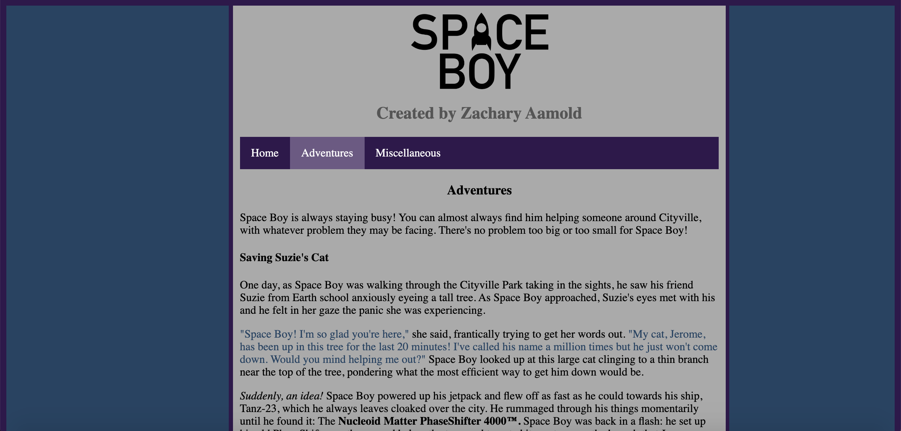
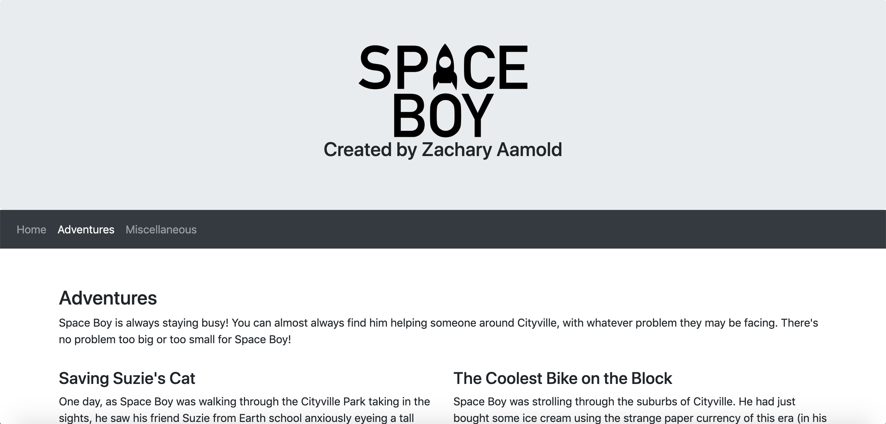

# SpaceBoy

This repository contains the HTML for a website I created detailing the life of my fictitious character, Space Boy. This project was done as part of an assignment to learn more about the use of Eclipse Jetty.

## From Scratch vs Bootstrap

This repository contains two versions of the project. The first was made from scratch using basic HTML/CSS and looks like this:

<p align="center">
  
</p>

The second version was made using the Bootstrap library and looks like this:

<p align="center">
  
</p>

## Running Jetty

In order to run either of these projects on your computer, you may use these terminal commands:
```
cd project-folder
java -jar start.jar --module=http jetty.http.port=8080
```
From there, you can enter `http://localhost:8080` into your browser and the website should appear.
